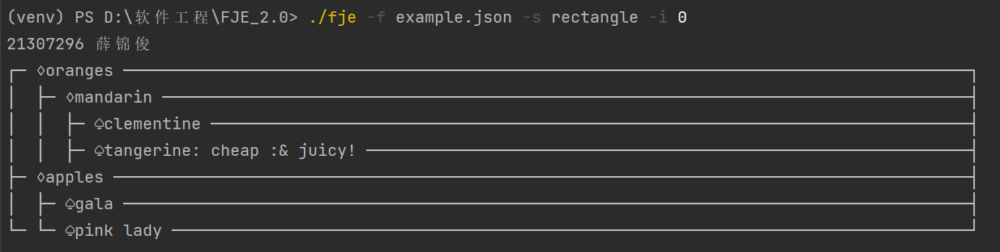

# Funny_Json_Explorer_2.0

# 设计文档

## 类图

#### 设计模式
本项目通过迭代器模式和访问者模式实现了对复杂 JSON 数据结构的灵活遍历和展示。迭代器模式提供了一种高效的遍历机制，而访问者模式则实现了数据结构与展示逻辑的分离，使得不同的展示方式可以独立扩展。

**访问者模式**   
访问者模式建议将新行为放入一个名为Visitor的独立类中， 而不是将其整合到已有类中。需要执行操作的原始对象将作为参数被传递给访问者中的方法， 让方法能访问对象所包含的一切必要数据。

Element对应的是作业中的 JSONComponent 类，JSONObject 和 JSONLeaf 是具体的element。  JSONComponent中的accept函数直接调用Visitor类中的函数，
JSONObject 和 JSONLeaf 实现了 accept 方法，分别调用访问者的 visitContainer 和 visitLeaf 方法。

而Visitor 则是单独实现的一个类，类中有两种方法, visitObject 和 visitLeaf。 而对应的两个ConcreteVisitor 分别是 TreeVisitor 和 RectangleVisitor，分别负责 风格为Tree 和 Rectangle时的情况

作用：
分离数据结构与作用于其上的操作，将有关操作封装到访问者中，使得新的操作可以很容易地添加。
如果要增加新的一个风格，只需要再增加一个ConcreteVisitor 类即可。

**迭代器模式**
迭代器是一种行为设计模式， 能在不暴露复杂数据结构内部细节的情况下遍历其中所有的元素。迭代器模式的主要思想是将集合的遍历行为抽取为单独的迭代器对象。
迭代器模式需要设计迭代器类和容器类。作业中我将JSONComponent设为容器类，JSONComponent类属性有JSONComponent 列表 作为集合， 会在渲染时遍历该列表。 
JSONComponent 通过 __iter__ 方法返回一个 JSONIterator 对象。   

迭代器类是专门设计的JSONIterator 类，提供一个获取集合元素的基本方法 Iter，以及**顺序遍历**要用到的next 函数。如果要其他的遍历方式可以使用不同迭代器类。
JSONIterator 维护一个栈来记录当前遍历的位置和状态。

作用：
隐藏了JSONComponent 中的内部实现，
如果要增加不同的children遍历方式只需要增加新的具体Iterator类

运行结果：

